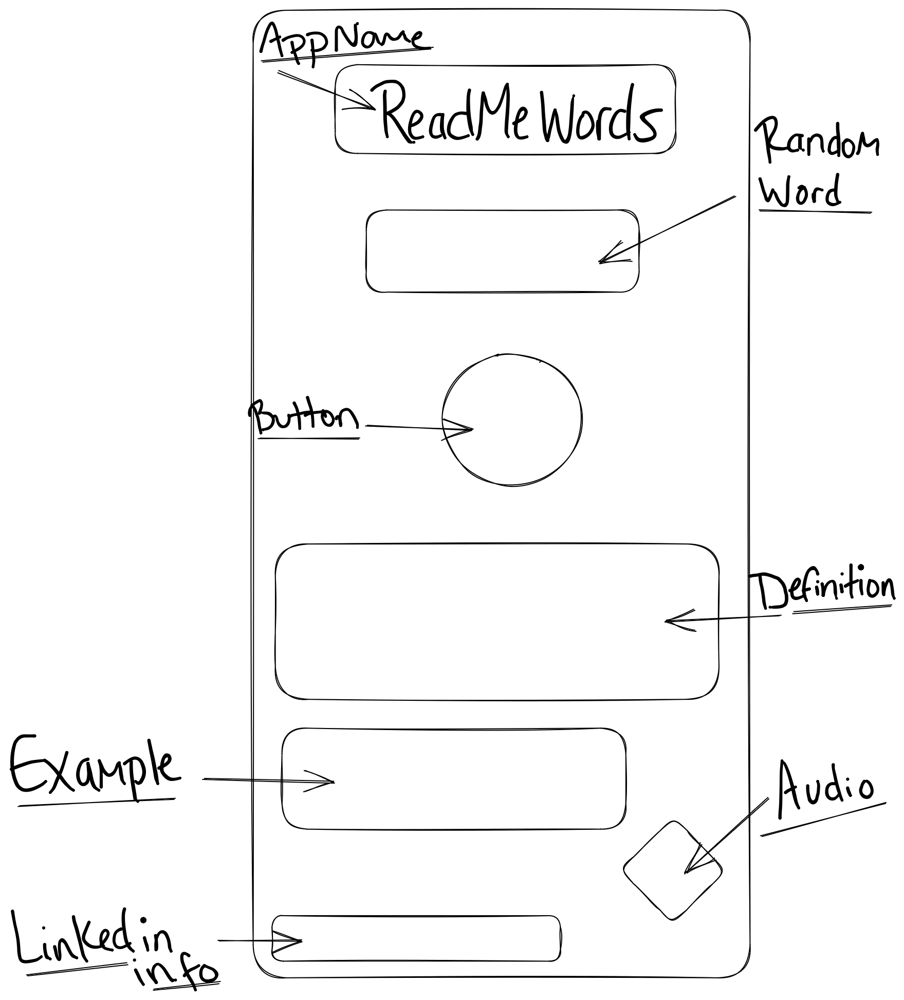

<!-- ("images/wireframe.png")  -->
<!--  -->

ReadMeWords in the name of the app

ReadMeWords is a dictionary that randomly generates popular words used in the English language along with their meanings, an example of how to use the given word and a audio pronunciation for selected words. The purpose of a dictionary is to provide clear, concise definitions and explanations of words, making it an essential tool for language learners, writers, and anyone who needs to communicate effectively.

API being used https://api.dictionaryapi.dev/api/v2

MVP - 
Randomly Generates words
Gives a defition for each word
Use the correct format to of API 
Good CSS & HTML

Tuesday - Make a outline for Project 1 
Wednesday - make the code for app and make sure code is working
Thursday - build app; each piece is working/ working together cohesively
Friday - CSS & HTML 
Saturday - debug; CSS & HTML
Sunday - finishing touches 

Reference URL:
  https://wtools.io/convert-list-to-json-array

  https://github.com/first20hours/google-10000-english

  https://api.dictionaryapi.dev/api/v2/entries/en/brilliant

  https://axios-http.com/docs/example

  https://github.com/Gregorio-Moreta/Different_API_Call_Examples
