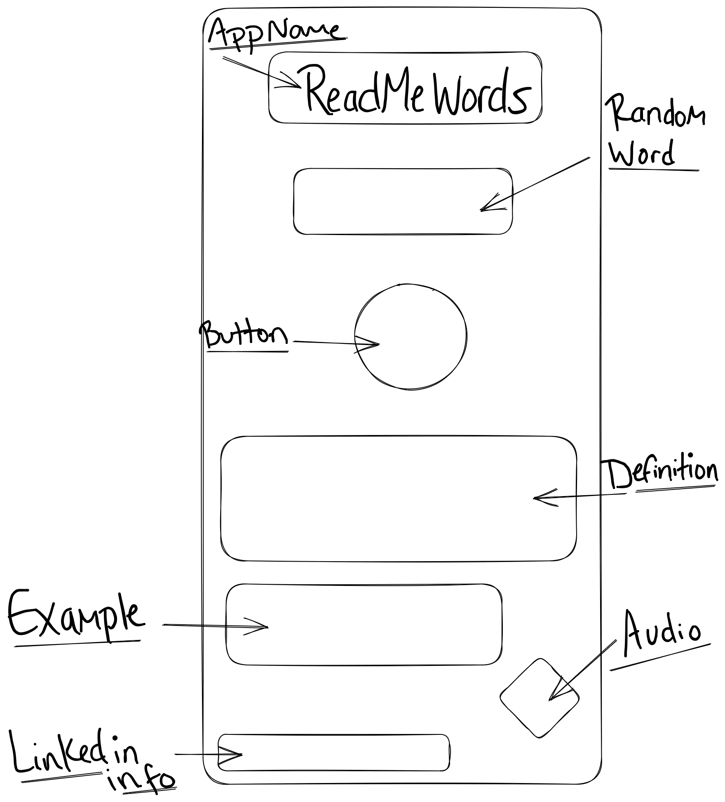

# ReadMeWords Dictionary App

Project 1

### Description:

ReadMeWords is a dictionary that randomly generates popular traditional and non-traditional words used in the English language along with their meanings, an example of how to use the given word and a audio pronunciation for selected words. The purpose of a dictionary is to provide clear, concise definitions and explanations of words, making it an essential tool for language learners, writers, and anyone who needs to communicate effectively.

### API:

Free Dictionary
https://dictionaryapi.dev/
https://api.dictionaryapi.dev/api/v2

### API Snippet:

// Async fetch function
async function fetchData() {
    const BASE_URL = "https://api.dictionaryapi.dev/api/v2/entries/en"
    //   // Write code here.
    try {
      const res = await fetch(`${BASE_URL}/${string}`)
      const json = await res.json()
      console.log('fetch     ', json);
      return json[0] 
      }
    catch {
      console.log("error");
    }
  }

fetchData()

###WireFrame: 

## MVP: 

- Create a onclick function that will pull the term, defintion example and audio pronunciation from the API objects
- Test API, if functional and able to use
- Create a functin that will toggle between two different array of chosen words
- Create either an additional button that will refresh the information or refresh the information after each click of the button 

## Post-MVP

- Add additional array
- create a loop that will loop over a word if it doesn't have a definition 
- Good CSS & HTML (visually appealing)

### WeekOutline

- **Tuesday** - Pseudocode for Project 1 come up with name and potentional app layout and functionality 
- **Wednesday** - Hard code; make sure I'm able to pull the information from the API & DOM
- **Thursday** - build app; each piece is working/ working together cohesively
- **Friday** - CSS & HTML 
- **Saturday** - CSS & HTML & debug
- **Sunday** - finishing touches 

##Priority Matrix

###Reference URL:

  1. https://wtools.io/convert-list-to-json-array
  2. https://github.com/first20hours/google-10000-english
  3. https://api.dictionaryapi.dev/api/v2/entries/en/brilliant
  4. https://axios-http.com/docs/example
  5. https://github.com/Gregorio-Moreta/Different_API_Call_Examples